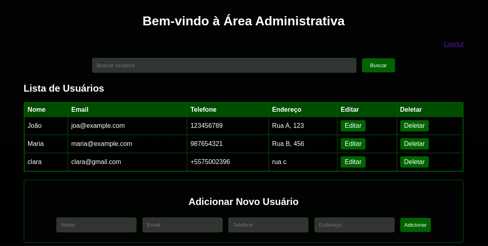

# Sistema de Gestão de Usuários

Sistema web para Gestão de usuários,você poderá visualizar, adicionar,editar e excluir usuários. Contem apenas duas intefaces a de login e tela home principal para realizar as operações de grud nun banco de dados sql 

## Tecnologias Utilizadas

- Java
- Servlets
- JSP (JavaServer Pages)
- JSTL (JSP Standard Tag Library)
- MySQL
- Maven
- Html e Css

## Configuração do Banco de Dados

1. Certifique-se de ter um servidor MySQL em execução localmente ou em um servidor remoto.
2. Crie um banco de dados chamado `usuarios`.
3. Execute o script `create_table.sql` fornecido para criar a tabela `usuarios` com os campos necessários.

## Configuração do Projeto

1. Clone este repositório para o seu ambiente local.
2. Importe o projeto em sua IDE favorita.
3. Configure a conexão com o banco de dados no arquivo `DatabaseUtil.java`.
4. Certifique-se de ter o Apache Tomcat configurado em sua IDE para executar o projeto.

## Execução do Projeto

1. Execute o servidor Tomcat em sua IDE.
2. Acesse a URL `http://localhost:8080/users_manipulation` em seu navegador.
3. Ao iniciar a aplicação será exibido um tela de login e vocẽ poderá logar no sistema com seguntes credencias:
Email: "admin@example.com", 
Senha: "admin"

## Funcionalidades

- Visualizar lista de usuários cadastrados.
- Adicionar novos usuários com nome, email, telefone e endereço.
- Editar informações de usuários existentes.
- Excluir usuários da lista.

---

Sinta-se à vontade para abrir PRs e relatar problemas
